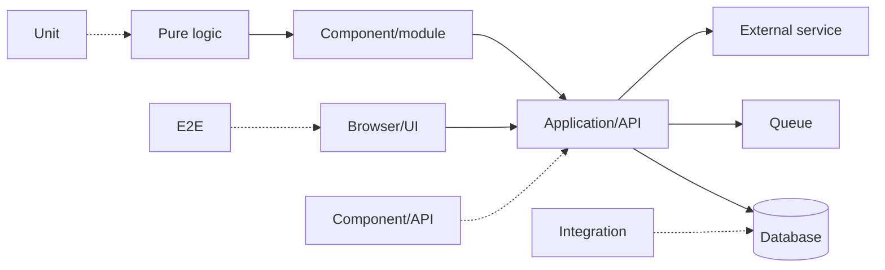

# 00 — Testing Foundations

## Wall Note / A4

- A test is an executable claim about **observable behavior**.
- Good tests maximize relevant signal and minimize noise.
- Test the **risk**, not the implementation.
- Every test has a boundary, stimulus, oracle, fixture, isolation model and cost.
- Determinism beats arbitrary waiting.
- A suite that never fails may be useless; one that fails randomly is untrustworthy.

## Detailed Notes

### The model

Testing reduces uncertainty; it does not prove absence of defects in a non-trivial system. A useful test asks a falsifiable question: given state **S**, when stimulus **X** occurs, does observable outcome **Y** satisfy the required invariant?

Every test has:
1. **Boundary** — what is inside/outside.
2. **Fixture** — required state/data.
3. **Stimulus** — call, request, event, UI action, clock tick.
4. **Oracle** — how correctness is judged.
5. **Isolation** — shared vs controlled state/dependencies.
6. **Lifecycle** — setup, cleanup, retries, parallelism.

### Core principles

**Behavior over structure.** Refactoring that preserves behavior should not cause broad test rewrites. Assertions about private calls/fields create refactor tax.

**Risk over uniformity.** Auth, money, migrations, data loss and concurrency deserve stronger evidence than trivial mappers.

**Failure localization.** Tests should fail close enough to the cause to make diagnosis cheap.

**Independent repeatability.** A test should normally pass alone, in random order and in parallel.

**Hermetic where valuable.** Control time, randomness, filesystem, network and external state when they are not the behavior under test.

### Oracles

Oracles can be exact values, invariants, state transitions, protocol responses, events, metamorphic relations or a trusted reference implementation.

Weak oracle: "returned 200."  
Stronger oracle: correct status + schema + persisted effect + idempotency invariant.

### Boundaries



A boundary is a design decision, not a framework annotation.

### Common failure modes

- mirroring implementation structure;
- giant shared fixtures;
- arbitrary sleeps;
- real clocks/randomness;
- shared mutable state;
- order-dependent tests;
- weak assertions;
- tests named after methods rather than behavior.

## Practical Example

Bad:

```java
service.process(order);
verify(repository).save(any());
verify(email).send(any());
```

Better:

```java
var clock = Clock.fixed(Instant.parse("2026-01-10T10:00:00Z"), ZoneOffset.UTC);
var events = new InMemoryEventSink();
var service = new OrderService(repository, events, clock);

service.pay(orderId, Money.eur("25.00"));

assertThat(repository.get(orderId).status()).isEqualTo(CONFIRMED);
assertThat(events.single(ReceiptIssued.class).orderId()).isEqualTo(orderId);
```

The oracle is business behavior, not incidental calls.

## Exercises / Senior Questions

1. Which defect classes can your unit suite never detect?
2. When is a real clock/network/database part of the behavior?
3. How would you debug a test that only fails in the full suite?
4. What makes an oracle too weak?
5. Why is "all tests green" insufficient evidence?

## Related / Prerequisite Links

- [Programming principles](https://github.com/YosrBennagra/programming-principles)
- [Software architecture](https://github.com/YosrBennagra/software-architecture)
- Next: [Strategy](01-strategy-and-test-shapes.md)
