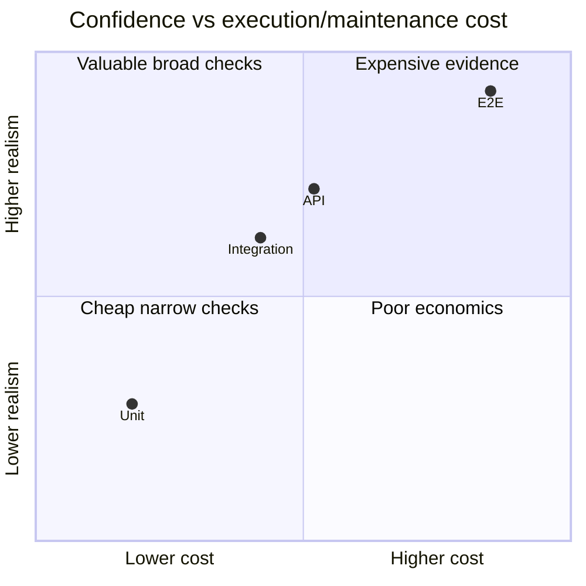

# 01 — Test Strategy, Pyramid, Trophy and Trade-offs

## Wall Note / A4

- Strategy maps **risk → evidence**.
- Pyramid/trophy are heuristics, never quotas.
- Broad tests are realistic but costly and poor at localization.
- Narrow tests are fast but can miss integration semantics.
- Optimize confidence per execution + maintenance cost.

## Detailed Notes

A senior strategy answers:
- What can fail?
- What is impact and likelihood?
- Which boundary exposes it cheaply?
- Which dependencies must be real?
- Which journeys deserve E2E proof?
- What evidence is required before merge/deploy/release?
- What remains to production monitoring?

Useful heuristic:

`priority ≈ probability × impact × difficulty-of-detection`

### Pyramid

Many fast unit tests, fewer integration tests, very few E2E tests.

Strengths: speed, localization, low infrastructure cost.  
Failure mode: "mock everything," validating code against self-invented mocks rather than reality.

### Testing trophy

Static analysis + many integration tests + fewer unit and E2E tests.

Strength: emphasizes behavior across realistic module boundaries.  
Failure mode: "integration" becomes an expensive undefined middle bucket.

### Confidence per cost

Positions vary by system. The point is economics, not a fixed ratio.

### Layer selection

Prefer unit tests for algorithms, invariants, decision tables, validation and transformations.

Prefer integration for ORM mappings, SQL, transactions, serializers, framework wiring, security filters, queues.

Prefer E2E for a small number of critical deployed journeys and browser/server behavior that is uneconomic to prove below.

Static types/compilers/linters are part of the evidence system; do not re-test what they already guarantee without a runtime reason.

## Practical Example

For "customer places order":

| Risk | First evidence |
|---|---|
| discount rule wrong | unit |
| JSON incompatible | API/contract |
| transaction loses items | DB integration |
| inventory message wrong | integration/contract |
| checkout UI wiring broken | component |
| deployed critical journey broken | E2E |

## Exercises / Senior Questions

1. Why can 5,000 unit tests produce less confidence than 300 well-selected tests?
2. Design a portfolio for money transfer.
3. When would you intentionally violate the pyramid?
4. Which tests belong pre-merge vs nightly vs pre-release?
5. When is deleting a test correct?

## Related / Prerequisite Links

- [Foundations](00-foundations.md)
- [Software architecture](https://github.com/YosrBennagra/software-architecture)
