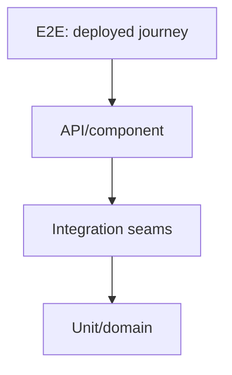

# 02 — Unit, Integration, Component, API and E2E

## Wall Note / A4

- Level = **boundary**, not framework/tool.
- Unit: cohesive logic with cheap collaborators.
- Integration: real infrastructure/framework semantics.
- Component: deployable/module boundary with controlled externals.
- API: protocol + contract + observable effects.
- E2E: few critical deployed journeys.
- Do not repeat the same assertion at every level.

## Detailed Notes

### Unit

A unit is a cohesive behavior boundary, not necessarily one class. Best targets: algorithms, branching policies, invariants, parsers, transformations and state machines.

### Integration

Proves infrastructure seams: database, filesystem, HTTP serialization, framework container, queue, external protocol.

A useful integration test can detect wrong column types, transaction semantics, JSON mapping, security configuration or message headers.

### Component

Treat a service/module as a black box with controlled external systems. Boot real application wiring, call a public interface, replace only expensive/unavailable externals.

### API

Strong API tests cover status, headers, schema, validation, authorization, idempotency, pagination/filtering, side effects and error models. API design itself belongs in [api-engineering](https://github.com/YosrBennagra/api-engineering).

### E2E

Use E2E for critical integration of layers that cannot be proven cheaply below.

Avoid brittle CSS selectors, shared accounts/data, real third-party production systems, hidden retries and turning every acceptance criterion into browser automation.

## Practical Example

REST create-order endpoint:

- **Unit:** discount + eligibility.
- **Integration:** real PostgreSQL unique constraint + transaction.
- **API/component:** POST JSON → 201 + schema + persisted order.
- **E2E:** one browser checkout happy path.

## Exercises / Senior Questions

1. Define integration test without naming a framework.
2. Which layer should test a DB unique constraint?
3. Why is the same happy path at five levels wasteful?
4. When is E2E the cheapest reliable evidence?
5. Reclassify tests in a codebase by actual boundary.

## Related / Prerequisite Links

- [Database engineering](https://github.com/YosrBennagra/database-engineering)
- [API engineering](https://github.com/YosrBennagra/api-engineering)
