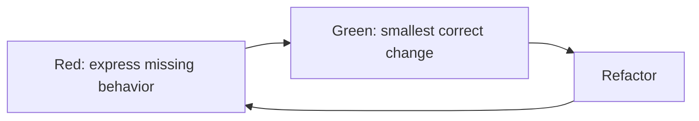

# 03 — Test Doubles, TDD and BDD

## Wall Note / A4

- Stub = controlled answer.
- Spy = records interactions.
- Mock = interaction expectations.
- Fake = lightweight working implementation.
- Do not mock every class.
- TDD = red → green → refactor.
- BDD = shared behavioral language, not syntax decoration.

## Detailed Notes

### Test doubles

**Stub:** predefined answers.  
**Spy:** records calls for later assertions.  
**Mock:** carries expected interactions.  
**Fake:** simplified working dependency, such as in-memory repository or fake clock.

Fakes enable state-based tests but may drift from production semantics; integration/contract tests control this drift.

Use doubles to control nondeterminism, isolate expensive externals, force rare failures and observe output-only collaborations.

Avoid doubles when the real dependency is cheap and its semantics are the risk, or when the test simply reproduces implementation call order.

### TDD



Benefits: observable design, continuous regression evidence, dependency feedback.

Failure modes: after-the-fact tests branded as TDD, overfitting examples, refusing exploratory spikes.

### BDD

Good BDD scenarios describe domain behavior.

Bad: "Given I click #submit, then API is called."  
Better: "Given a suspended account, when it attempts a transfer, then no debit is recorded."

BDD is valuable when ambiguity across roles is expensive; it need not wrap every function.

## Practical Example

```java
var clock = new MutableClock("2026-01-01T00:00:00Z");
var service = new TokenService(clock);

var token = service.issue(userId);
clock.advance(Duration.ofMinutes(31));

assertThat(service.isValid(token)).isFalse();
```

A fake clock gives deterministic time behavior without static mocking.

## Exercises / Senior Questions

1. Explain fake vs stub with one real example.
2. What signals over-mocking?
3. When is interaction verification the correct oracle?
4. Where is TDD useful vs ceremonial?
5. Rewrite an implementation-focused BDD scenario.

## Related / Prerequisite Links

- [Programming principles](https://github.com/YosrBennagra/programming-principles)
- [Design patterns](https://github.com/YosrBennagra/design-patterns)
