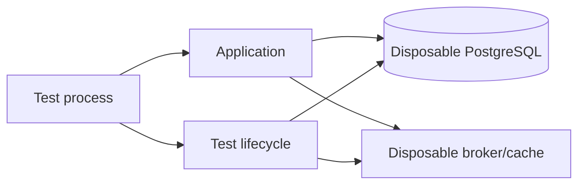

# 04 — Contract, Database, Transactional Testing and Testcontainers

## Wall Note / A4

- Contract tests protect **independently changing boundaries**.
- Consumer-driven contracts verify what consumers actually depend on.
- DB tests must respect transactions, constraints, isolation and dialect.
- Rollback-per-test can hide commit-time behavior.
- Testcontainers trades startup cost for realistic semantics.

## Detailed Notes

### Contract tests

A contract test verifies agreement at an independently deployable boundary: request/response/message schema, status/error semantics, required headers and fields.

Consumer-driven contracts encode the subset a consumer depends on, then the provider verifies it in CI.

They do not prove whole workflows, deployment policies or internal correctness.

### Database testing

Real DB semantics matter for SQL dialects, constraints, isolation, indexes/plans, migrations, locking, triggers/defaults and transaction behavior.

An in-memory DB is poor evidence for PostgreSQL-specific locking or JSONB behavior.

### Transactional tests

Rollback after each test is convenient but can hide after-commit hooks, deferred constraints, cross-transaction visibility and propagation issues. Explicitly test commit semantics when they matter.

### Testcontainers



Practices:
- pin compatible images;
- apply real migrations;
- wait on semantic readiness;
- isolate schemas/databases/topics under parallel CI;
- reuse containers only if state isolation remains explicit.

## Practical Example

```java
@Testcontainers
class OrderRepositoryIT {
  @Container
  static PostgreSQLContainer<?> postgres =
      new PostgreSQLContainer<>("postgres:17");

  @Test
  void duplicateExternalIdIsRejected() {
    repository.save(order("ext-42"));
    assertThatThrownBy(() -> repository.save(order("ext-42")))
        .isInstanceOf(DataIntegrityViolationException.class);
  }
}
```

The value is actual constraint semantics, not "using Docker."

## Exercises / Senior Questions

1. What drift can exist between fake repository and PostgreSQL?
2. Design contract testing across three services.
3. Why can rollback-per-test hide bugs?
4. What should be shared vs isolated in parallel DB tests?
5. When is Testcontainers excessive?

## Related / Prerequisite Links

- [Database engineering](https://github.com/YosrBennagra/database-engineering)
- [API engineering](https://github.com/YosrBennagra/api-engineering)
- [DevOps/platform engineering](https://github.com/YosrBennagra/devops-platform-engineering-)
