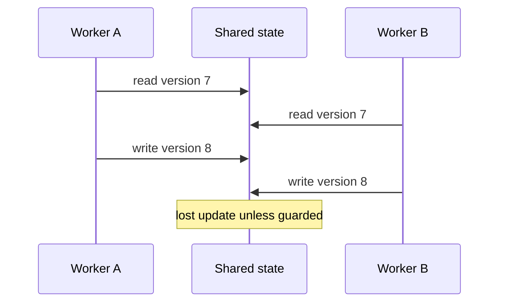

# 05 — Frontend, Async and Concurrency Testing

## Wall Note / A4

- Assert what users can perceive/do.
- Prefer role/label queries over DOM structure.
- Use virtual time/fake schedulers instead of sleeps.
- Await semantic completion.
- Concurrency tests need controlled coordination + invariants.
- One successful concurrent run does not prove race-freedom.

## Detailed Notes

### Frontend

Useful boundaries:
- pure validators/formatters/reducers;
- component render + realistic providers;
- router/HTTP/state integration;
- minimal E2E critical journeys.

Avoid huge snapshots, private field assertions, brittle CSS selectors and framework-internal testing.

Angular mechanics belong in [angular-mastery](https://github.com/YosrBennagra/angular-mastery).

### Async

Ask: **what observable condition marks completion?**

Bad:
```ts
await new Promise(r => setTimeout(r, 1000));
expect(result).toEqual(expected);
```

Better: await the promise, advance fake time, wait for semantic DOM state, consume a stream to a meaningful event, or use a latch/barrier.

### Concurrency

Test invariants:
- no lost update;
- idempotency;
- ordering guarantees;
- bounded resources;
- cancellation;
- deadlock/livelock resistance where feasible.



Use barriers to force race windows instead of hoping the scheduler does.

## Practical Example

```ts
render(<Checkout total={25} onConfirm={confirm} />);
await user.click(screen.getByRole('button', { name: /pay/i }));
expect(confirm).toHaveBeenCalledWith({ total: 25 });
expect(screen.getByRole('status')).toHaveTextContent(/processing/i);
```

The principle applies across frontend frameworks.

## Exercises / Senior Questions

1. Why are sleeps both slow and flaky?
2. How do you deterministically test debounce?
3. Design a lost-update concurrency test.
4. Which browser behavior deserves E2E?
5. What is wrong with blindly updated snapshots?

## Related / Prerequisite Links

- [Angular mastery](https://github.com/YosrBennagra/angular-mastery)
- [Java mastery](https://github.com/YosrBennagra/java-mastery)
