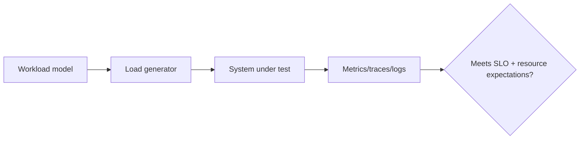

# 07 — Performance, Load, Stress and Security Testing

## Wall Note / A4

- Performance requires a workload model + acceptance criteria.
- Load = expected demand; stress = beyond limit; soak = duration; spike = rapid change.
- Read percentiles, throughput, errors and saturation together.
- Environment/warmup/cache state shape results.
- Security scanners provide evidence, never proof.

## Detailed Notes

### Performance

Define before running:
- request mix;
- open vs closed arrival model;
- concurrency/arrival rate;
- payload/data distribution;
- warmup/cache state;
- duration/environment;
- SLO thresholds.

Measure p50/p95/p99, throughput, error rate, queue depth, CPU/memory/GC, DB/connection pool saturation.

A faster average can hide worse tail latency.

### Types

- **Load:** expected/peak demand.
- **Stress:** capacity/failure mode beyond expected demand.
- **Soak:** leaks and resource exhaustion over time.
- **Spike:** fast traffic changes/autoscaling/backpressure.

### Security testing concepts

Layers include dependency scanning, SAST, secret scanning, DAST, fuzzing, authorization invariants, abuse/rate-limit tests and security review.

Security design belongs in [application-security](https://github.com/YosrBennagra/application-security).

A clean scanner result is not proof. Strong authorization tests encode invariants such as "tenant A can never read tenant B data."

## Practical Example

A useful performance acceptance statement:

> At a realistic 70/20/10 read/create/update mix and target peak arrival rate, p95 stays within the agreed SLO, error rate remains below threshold and DB pool saturation stays below its safe limit for 30 minutes.

"Run 1,000 users" alone is not a strategy.

## Exercises / Senior Questions

1. Why is average latency insufficient?
2. Design a checkout workload model.
3. What does stress reveal that load does not?
4. Which authorization invariants should be automated?
5. Why do SAST + DAST not prove security?

## Related / Prerequisite Links

- [System design](https://github.com/YosrBennagra/system-design)
- [Application security](https://github.com/YosrBennagra/application-security)
