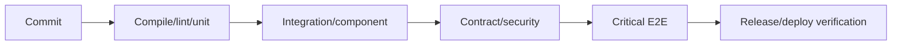

# 08 — Flaky Tests, CI Quality Gates and Distributed Systems

## Wall Note / A4

- A flaky test has an uncontrolled dependency.
- Never normalize "rerun until green."
- Quarantine only with owner + visibility + deadline.
- CI gates optimize trust and feedback.
- Distributed tests must cover timeout, retry, duplicate, reorder, partial failure and eventual consistency.
- Assert invariants, not instantaneous global state.

## Detailed Notes

### Flakiness causes

Real time/time zones, uncontrolled randomness, shared DB/filesystem/accounts, order dependence, ports/processes, eventual consistency, async races, external services and resource starvation.

Diagnosis:
1. run alone;
2. repeat;
3. randomize order;
4. increase parallelism;
5. freeze time/randomness;
6. record seed/state;
7. inspect shared resources.

Retries may collect evidence temporarily but must not redefine failure as success.

### CI quality gates



Principles:
- fastest high-signal checks first;
- actionable failure output;
- expensive suites sharded/selective/scheduled;
- ownership explicit;
- flaky tests tracked as defects;
- risky changes can trigger deeper validation.

### Distributed systems

Inject:
- timeout/slow dependency;
- retries;
- duplicate delivery;
- reordering;
- unavailable dependency;
- partial commit;
- failover;
- stale reads/eventual consistency;
- clock skew where relevant.

Use bounded eventual assertions rather than arbitrary sleeps.

## Practical Example

```text
Given command P has idempotency key K
When P is delivered twice
Then exactly one logical payment exists for K
And exactly one external charge occurs
And both deliveries leave consistent state
```

## Exercises / Senior Questions

1. Debug a 1% flaky E2E test.
2. When is quarantine acceptable?
3. Design CI for a monorepo with 20-minute integration tests.
4. Test eventual consistency without sleep(5000).
5. Inject duplicate/reordered events.

## Related / Prerequisite Links

- [System design](https://github.com/YosrBennagra/system-design)
- [DevOps/platform engineering](https://github.com/YosrBennagra/devops-platform-engineering)
