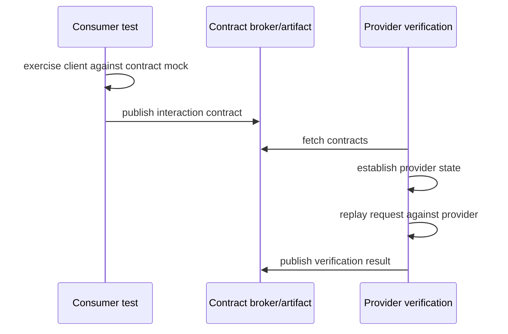

# 11 — Contracts, Databases and Testcontainers in Practice

## Wall Note / A4

- Contract tests protect deployability between independently changing systems.
- Schema compatibility is necessary but not sufficient for behavioral compatibility.
- Provider state setup must be deterministic and minimal.
- Database tests should exercise the production dialect when dialect semantics matter.
- Container lifecycle and test-data lifecycle are separate concerns.
- Reused containers improve speed but require stronger isolation.
- Parallel execution changes the design of fixtures, ports, schemas and queues.

## Detailed Notes

### 1. Contract-testing workflow

Consumer-driven contracts are valuable when:
- consumer and provider deploy independently;
- a consumer relies on a subset of provider behavior;
- full E2E environments are slow or fragile;
- teams need early compatibility feedback.



A contract should describe what the consumer **needs**, not mirror the provider's entire response.

### 2. Contract granularity

Bad:
- asserting every provider field;
- freezing irrelevant ordering;
- hard-coding timestamps/IDs with no semantic meaning;
- embedding full business workflows.

Better:
- minimum fields required by the consumer;
- semantic matchers for IDs/timestamps;
- one interaction per meaningful consumer expectation;
- provider states that describe business preconditions.

### 3. Provider states

Provider state should establish preconditions such as:
- customer exists;
- account is suspended;
- invoice has already been paid.

It should not encode an entire E2E scenario in setup scripts.

Provider-state setup must be repeatable and isolated because verification may replay interactions in any order.

### 4. Contract versioning and deployment safety

A mature flow answers:

- Can provider version P deploy without breaking currently deployed consumers?
- Can consumer version C deploy against currently deployed provider?
- Which verified contract versions correspond to deployable artifacts?

A broker can provide compatibility metadata, but the engineering policy still needs ownership and release rules.

### 5. Database integration: what deserves realism

Use the production database engine when the risk involves:
- dialect-specific SQL;
- unique/foreign/check constraints;
- transaction isolation;
- locking;
- JSON/array/full-text features;
- generated columns/triggers;
- migration correctness;
- query plans;
- collation/case rules.

An in-memory substitute is acceptable when those semantics are explicitly out of scope.

### 6. Transaction isolation tests

Example lost-update scenario:

```text
T1 reads balance = 100
T2 reads balance = 100
T1 writes 80
T2 writes 70
final = 70   // T1 update lost
```

A deterministic integration test should coordinate both transactions with barriers/latches so the race window is intentional.

### 7. Testcontainers lifecycle

Typical choices:

**Per-test container**
- strongest isolation;
- slowest startup;
- useful for stateful destructive tests.

**Per-class container**
- good default for many suites;
- reset data per test.

**Suite/shared container**
- fastest;
- requires robust logical isolation;
- accidental state coupling is easier.

Do not equate "container is fresh" with "test data is isolated."

### 8. Avoid fixed ports and localhost assumptions

Use mapped host/port values provided by the container runtime. Fixed ports make local and CI parallelism fragile.

### 9. Migration testing

A high-value integration suite:
1. starts empty production-like DB;
2. runs the exact migration mechanism used in deployment;
3. validates schema expectations;
4. executes repository/query behavior;
5. optionally tests upgrade from representative prior schema snapshots for risky migrations.

Do not rely only on ORM auto-create if production uses explicit migrations.

### 10. Parallelism strategy

For database tests, choose one:

- unique database per worker;
- unique schema per test class;
- namespaced rows by test ID;
- transaction rollback only when it faithfully models behavior.

For brokers/queues:
- unique topic/queue names per worker;
- unique consumer groups;
- deterministic cleanup.

## Practical Example — PostgreSQL integration test

```java
@Testcontainers
class AccountRepositoryIT {

  @Container
  static PostgreSQLContainer<?> postgres =
      new PostgreSQLContainer<>("postgres:17");

  @BeforeAll
  static void migrate() {
    var dataSource = dataSource(
        postgres.getJdbcUrl(),
        postgres.getUsername(),
        postgres.getPassword()
    );
    runProductionMigrations(dataSource);
  }

  @Test
  void duplicate_external_reference_is_rejected() {
    repository.insert(account("ext-42"));

    assertThatThrownBy(() -> repository.insert(account("ext-42")))
        .isInstanceOf(DataIntegrityViolationException.class);
  }
}
```

The important property is not container usage itself; it is verifying production-relevant constraint semantics.

## Practical Example — consumer contract intent

Consumer expectation:

```json
{
  "request": { "method": "GET", "path": "/customers/42" },
  "response": {
    "status": 200,
    "body": {
      "id": "42",
      "displayName": "Ada"
    }
  }
}
```

Do not assert 25 provider fields if the consumer only reads two.

Provider verification must still run against the real provider endpoint, with downstream dependencies controlled enough to make the result deterministic.

## Failure Modes

- Contract files generated from mocks but never verified by provider.
- Provider verification stubs the endpoint being verified.
- Contract asserts too much and blocks harmless provider evolution.
- Database test uses H2/SQLite while production depends on PostgreSQL behavior.
- Testcontainers suite is serialized unnecessarily.
- Shared DB container leaks data across tests.
- Tests bypass production migrations.
- Parallel tests reuse the same queue/topic/account.

## Exercises / Senior Questions

1. Design a contract pipeline for three consumers and one provider.
2. Which response fields should a consumer contract include?
3. How would you test a destructive migration safely?
4. Compare schema-per-test-class with database-per-worker isolation.
5. Why can a shared container still produce nondeterministic tests?
6. Write a deterministic test plan for optimistic-lock conflict.

## Related / Prerequisite Links

- [Contract/DB/Testcontainers core](04-contract-db-testcontainers.md)
- [API engineering](https://github.com/YosrBennagra/api-engineering)
- [Database engineering](https://github.com/YosrBennagra/database-engineering)
- [DevOps/platform engineering](https://github.com/YosrBennagra/devops-platform-engineering)
