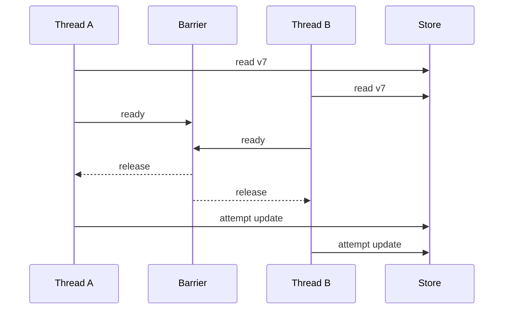

# 12 — Async, Concurrency and Distributed-System Testing in Practice

## Wall Note / A4

- Replace timing guesses with synchronization you control.
- Test concurrency by forcing interleavings.
- Test distributed behavior by injecting failures at boundaries.
- Retry tests must prove **classification + backoff + idempotency**, not only "eventually succeeded."
- Eventual consistency needs bounded semantic polling.
- Duplicate delivery is normal in many delivery models; make invariants explicit.
- Chaos without hypotheses is noise.

## Detailed Notes

### 1. Async tests: wait for meaning

Bad:

```java
Thread.sleep(2000);
assertThat(cache.get(key)).isPresent();
```

Why it fails:
- 2 seconds may be insufficient on slow CI;
- it wastes time on fast machines;
- it does not tell you what condition should have completed.

Prefer:
- future/promise completion;
- fake/virtual clocks;
- barriers/latches;
- event observation;
- bounded polling for externally eventual systems.

### 2. Virtual time

Time-sensitive code should depend on a clock/scheduler abstraction when possible.

Test:
- expiration;
- retry delay;
- debounce;
- scheduled cleanup;
- rate-limit windows.

without waiting real seconds/minutes.

### 3. Controlled concurrency

A race test should deliberately align competing operations.



Then assert the invariant:
- one update rejected by optimistic locking;
- or serialized outcome;
- or no lost update.

### 4. Stress is not proof of race-freedom

Running a concurrent test 10,000 times can increase confidence but remains probabilistic if interleavings are uncontrolled.

Use stress runs as supplementary evidence, not a substitute for deterministic synchronization or formal reasoning.

### 5. Retry behavior

Test at least:
- retryable classification;
- non-retryable errors are not retried;
- maximum attempts;
- backoff/jitter policy through virtual time where possible;
- idempotency across retries;
- observability/metrics for exhausted retries.

Do not hide retries inside test helpers; test the retry policy itself.

### 6. Timeout ambiguity

A timeout often means **unknown outcome**, not failure.

Example:
- payment provider accepted request;
- response was lost;
- caller times out;
- retry can duplicate charge unless idempotency exists.

A strong test simulates this exact boundary condition.

### 7. Eventual consistency

Use bounded semantic polling:

```text
within 5 seconds:
  repeatedly read projection
  stop when projection.version >= event.version
  fail with last observed state if deadline expires
```

This is different from sleeping 5 seconds and checking once.

### 8. Messaging semantics

Test explicitly:
- duplicate message;
- out-of-order message;
- poison message;
- handler crash after side effect but before ack;
- redelivery after timeout;
- dead-letter path;
- schema evolution.

### 9. Distributed failure matrix

| Failure | Expected invariant |
|---|---|
| downstream timeout | bounded retry or explicit failure |
| duplicate message | one logical effect |
| delayed message | state eventually converges |
| out-of-order event | stale update rejected or safely reconciled |
| provider unavailable | degradation/circuit behavior as designed |
| partial commit | compensation/recovery path |
| consumer restart | resumable processing |

### 10. Fault injection

Inject faults at adapter boundaries:
- HTTP fake server returns 503/timeout/malformed body;
- broker test harness redelivers events;
- DB transaction deliberately conflicts;
- clock jumps;
- storage writes fail after partial work.

The closer the injection is to the real failure boundary, the more credible the evidence.

### 11. Chaos testing

Use chaos only with:
- explicit hypothesis;
- bounded blast radius;
- observable success criteria;
- rollback/abort conditions;
- mature baseline tests.

Example hypothesis:

> If one read replica becomes unavailable, read traffic remains within the latency/error SLO and writes remain unaffected.

"Randomly kill pods and see what happens" is not a test strategy.

## Practical Example — ambiguous timeout

```java
@Test
void timeout_after_provider_acceptance_does_not_double_charge() {
  var provider = new ScriptedPaymentProvider()
      .acceptChargeButTimeoutResponseOnFirstAttempt()
      .returnExistingChargeOnSameIdempotencyKey();

  var service = new PaymentService(repo, provider, retryPolicy);

  var result = service.charge(
      new ChargeCommand("idem-88", customerId, eur("40"))
  );

  assertThat(result.status()).isEqualTo(SUCCEEDED);
  assertThat(provider.uniqueChargesFor("idem-88")).hasSize(1);
  assertThat(repo.findByIdempotencyKey("idem-88")).hasSize(1);
}
```

Then add a real adapter/integration test to prove the provider request actually contains the idempotency key.

## Practical Example — bounded eventual assertion

```java
await()
  .atMost(Duration.ofSeconds(5))
  .pollInterval(Duration.ofMillis(100))
  .untilAsserted(() ->
      assertThat(readModel.find(orderId).status()).isEqualTo(SHIPPED)
  );
```

Use this only when eventual behavior is intrinsic. Do not use polling to paper over a deterministic local race.

## Exercises / Senior Questions

1. Write a deterministic lost-update test using a barrier.
2. Design a retry test where the first attempt succeeds remotely but times out locally.
3. Test duplicate event delivery across handler + DB transaction.
4. How would you test out-of-order events with version numbers?
5. When is bounded polling appropriate vs a code smell?
6. Define a safe chaos experiment for cache-node loss.

## Related / Prerequisite Links

- [Frontend/async/concurrency](05-frontend-async-concurrency.md)
- [Flakiness/CI/distributed](08-flakiness-ci-distributed.md)
- [System design](https://github.com/YosrBennagra/system-design)
- [Observability/reliability](https://github.com/YosrBennagra/observability-reliability)
