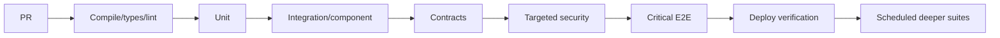

# 13 — CI Gates, Performance, Security and Suite Economics

## Wall Note / A4

- CI is a feedback system, not a checklist.
- Put cheap/high-signal gates first.
- Gate on evidence tied to risk; avoid arbitrary global thresholds.
- Performance tests require controlled workload + environment + comparison baseline.
- Security automation catches classes of defect, not all vulnerabilities.
- Measure suite health: duration, queue time, flake rate, defect yield, rerun rate, ownership.
- A slow trusted suite is improvable; a fast untrusted suite is dangerous.

## Detailed Notes

### 1. Pipeline economics

Lead time includes:
- queue time;
- environment provisioning;
- test execution;
- retries;
- human diagnosis.

A "10-minute suite" that queues 20 minutes and reruns 15% of the time is not a 10-minute feedback loop.

Track:
- median/p95 pipeline duration;
- time-to-first-actionable-failure;
- flake rate per test;
- rerun rate;
- top slow tests;
- failure ownership;
- escaped-defect classes.

### 2. Layered gates

Do not force every expensive test into every PR if:
- it adds little incremental confidence;
- it can be safely triggered by affected paths/risk labels;
- it is better suited to pre-release/nightly environments.

### 3. Quality gates

Good gate examples:
- no failed deterministic tests;
- no known critical security finding;
- contract verification for affected provider/consumer;
- migration compatibility check for schema-changing PR;
- performance regression beyond agreed threshold in controlled benchmark;
- coverage regression in a critical module requiring review.

Weak gate:
- "global line coverage must be >= 90%" with no risk model.

### 4. Change-aware selection

Test selection can use:
- dependency graph;
- changed modules;
- ownership metadata;
- risk classification;
- historical failure mapping.

But selection itself is a correctness problem. Maintain periodic full runs to detect missing dependency edges.

### 5. Performance-test credibility

Performance numbers are only comparable when you control:
- code version;
- infrastructure shape;
- dataset;
- warmup;
- caches;
- background load;
- workload distribution;
- client generation capacity.

Do not compare local laptop results with shared CI numbers as if they are one series.

### 6. Performance assertions

Avoid exact brittle thresholds for microbenchmarks unless environment is controlled.

Useful approaches:
- percentage regression vs baseline;
- SLO threshold with headroom;
- capacity knee detection;
- saturation-aware interpretation.

Always correlate latency with errors and saturation. A service can "improve" latency by rejecting more requests.

### 7. Security gates

Typical automation:
- SCA/dependency vulnerability checks;
- secrets scanning;
- SAST;
- IaC/container scanning where applicable;
- API/DAST checks;
- fuzz/property tests for parsers/protocols;
- authorization invariants.

Do not auto-block on noisy medium findings without triage policy, or teams will learn to ignore the system.

### 8. Security test ownership

A security finding needs:
- severity;
- exploitability/context;
- owner;
- remediation/acceptance decision;
- expiration/review date if risk is accepted.

Testing strategy should not duplicate secure-design guidance from [application-security](https://github.com/YosrBennagra/application-security).

### 9. Flaky test policy

Recommended lifecycle:
1. failure is visible;
2. owner assigned;
3. root cause investigated;
4. if necessary, temporary quarantine with issue + deadline;
5. fix or delete;
6. trend flake rate.

Never silently retry and mark green as the only record.

### 10. Suite optimization order

Before buying more CI machines:
1. delete redundant tests;
2. fix flakes/reruns;
3. move risks to cheaper boundaries;
4. parallelize independent work;
5. shard expensive suites;
6. cache/build incrementally where safe;
7. provision infrastructure concurrently;
8. only then add compute where economics justify it.

## Practical Example — risk-based PR policy

| Change | Required evidence |
|---|---|
| pure pricing rule | unit + mutation sample for critical logic |
| repository query | unit if useful + PostgreSQL integration |
| public API schema | API + contract verification |
| auth policy | authorization tests + targeted security checks |
| DB migration | migration integration + rollback/forward strategy check |
| UI copy only | type/build + focused component check |
| retry/idempotency | unit + adapter integration + distributed scenario |

This makes the pipeline explainable.

## Practical Example — performance regression triage

Observed:
- p95 latency +25%;
- throughput unchanged;
- error rate unchanged;
- DB CPU 95%;
- app CPU 40%.

Do not optimize Angular/frontend, thread pools or HTTP clients first. The evidence points toward database saturation/query behavior. Use tracing/query metrics to refine the hypothesis.

## Exercises / Senior Questions

1. Design a PR pipeline for a 40-service monorepo.
2. Which tests would you move out of the blocking path, and why?
3. Define a flake SLO and ownership model.
4. Review a 90% coverage gate and replace it with risk-based controls.
5. Design a trustworthy performance regression gate.
6. Decide which security findings should block deploy automatically.
7. Reduce a 45-minute suite using the optimization order above.

## Related / Prerequisite Links

- [Performance/security](07-performance-security.md)
- [Flakiness/CI/distributed](08-flakiness-ci-distributed.md)
- [DevOps/platform engineering](https://github.com/YosrBennagra/devops-platform-engineering)
- [Application security](https://github.com/YosrBennagra/application-security)
- [Observability/reliability](https://github.com/YosrBennagra/observability-reliability)
