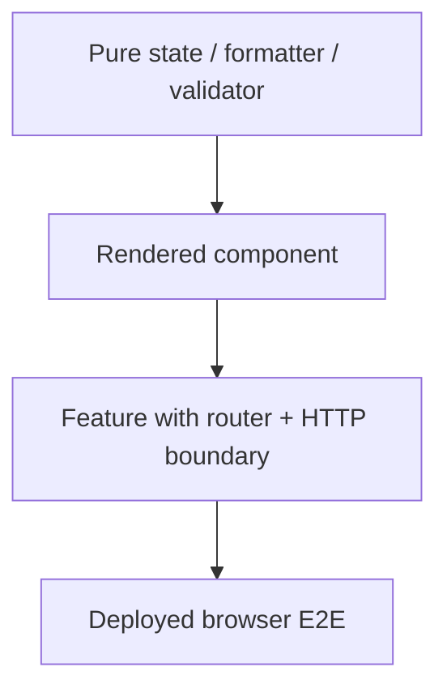

# 15 — Frontend, Component and E2E Testing Architecture

## Wall Note / A4

- Test the UI through what users can perceive and operate.
- Component tests should include framework rendering when rendering is the risk.
- Prefer role/name/label queries over CSS structure.
- Mock the network boundary deliberately; do not mock every component/service.
- E2E proves a small number of critical deployed journeys.
- Avoid sharing user accounts and data across parallel browser tests.
- A browser test that retries until green is still flaky.
- Accessibility assertions belong throughout the frontend test stack.

## Detailed Notes

### 1. Frontend test boundaries



Each boundary answers different questions.

**Pure logic**
- formatting;
- reducers;
- validation rules;
- derived state.

**Rendered component**
- template bindings;
- visible states;
- keyboard/click interaction;
- inputs/outputs;
- accessibility semantics.

**Feature integration**
- routing;
- state + components;
- HTTP adapter/interceptor boundary;
- permission-driven UX.

**E2E**
- deployed assets;
- real browser navigation;
- server/API integration;
- small set of critical journeys.

### 2. Query strategy

Prefer selectors in this order:

1. semantic role + accessible name;
2. label text;
3. visible text where stable;
4. explicit test identifier when no semantic selector exists;
5. CSS structure only as a last resort.

Good:

```text
getByRole('button', { name: 'Save order' })
```

Brittle:

```text
.container > div:nth-child(3) > button.btn-primary
```

Semantic queries test accessibility and behavior together.

### 3. What not to assert

Avoid assertions on:
- private component fields;
- internal framework metadata;
- exact helper-method calls;
- generated CSS class names;
- implementation-specific DOM wrappers with no user meaning.

A component refactor should not destroy behavior tests.

### 4. Mocking HTTP

At component/feature level, choose deliberately:

**Stub transport responses**
- deterministic;
- easy error/latency cases;
- does not prove server contract.

**Mock Service Worker / browser-level interception**
- realistic request path;
- reusable handlers;
- still not a real backend.

**Real backend/test environment**
- highest integration;
- slower;
- data isolation/environment reliability required.

Use contract/API tests elsewhere to prove backend compatibility rather than making every component test depend on a live server.

### 5. Loading, empty, error and partial states

Frontend tests should not only cover happy data.

For data-driven UI, test:
- loading;
- empty;
- successful content;
- validation failure;
- authorization/forbidden state;
- retryable failure;
- partial data if supported.

These are part of the component contract.

### 6. Async frontend behavior

Avoid arbitrary sleeps.

Instead await:
- element appearance/disappearance;
- enabled/disabled state;
- promise/Observable completion;
- router navigation;
- semantic progress status.

Use fake timers for debounce/delay logic only when time is intentionally the subject.

### 7. Accessibility as behavior

Automatable examples:
- form control has accessible label;
- dialog receives focus;
- escape closes modal when specified;
- tab order reaches interactive elements;
- error has accessible association;
- status changes are announced appropriately.

Automated rules do not replace real keyboard/screen-reader review on critical journeys.

### 8. E2E data isolation

Parallel E2E fails when tests share:
- one username;
- one shopping cart;
- one mutable tenant;
- one fixed order number.

Strategies:
- per-test user/tenant;
- unique identifiers;
- API-based deterministic setup;
- server fixture endpoint available only in test environments;
- cleanup or disposable environment.

The setup mechanism should be faster and more reliable than reproducing every prerequisite through the UI.

### 9. UI setup vs API setup

If the test is "user can refund an existing paid order," creating the order through 20 UI steps before every test adds noise.

Use API/data setup to create a paid order, then exercise refund via UI.

Use full UI setup only when the earlier journey is itself the behavior being proved.

### 10. Third parties

Do not depend on real email/payment/maps providers in ordinary E2E.

Instead:
- use sandbox/fake provider;
- intercept at your integration boundary;
- separately maintain focused provider integration tests.

### 11. Visual regression

Visual tests are useful for:
- design systems;
- layout-heavy components;
- cross-browser regressions.

They are weak when:
- snapshots cover entire unstable pages;
- font/animation/time differences create noise;
- changes are approved blindly.

Mask nondeterministic regions and keep ownership clear.

### 12. Browser matrix

Run browsers based on supported-user risk, not maximal combinations.

Possible strategy:
- primary browser on every PR;
- secondary supported engines on merge/nightly;
- mobile viewport/real-device checks for critical flows.

### 13. E2E retries

A retry can collect diagnostic evidence but should not silently convert an unstable test into "pass."

Track first-attempt failure separately. Fix the root cause.

### 14. Page objects and abstractions

Page objects can centralize stable user actions:

```text
CheckoutPage.enterShippingAddress(...)
CheckoutPage.pay(...)
CheckoutPage.expectConfirmation(...)
```

Bad page objects merely wrap every selector one-to-one and hide what the test does.

Favor domain/user language.

## Practical Example — component boundary

Framework-neutral intent:

```ts
renderCheckout({ total: 25 });

await user.click(
  screen.getByRole('button', { name: /pay/i })
);

expect(
  screen.getByRole('status')
).toHaveTextContent(/processing/i);
```

For Angular-specific TestBed/rendering mechanics, see [angular-mastery](https://github.com/YosrBennagra/angular-mastery).

## Practical Example — isolated E2E scenario

```text
Given API setup creates paid order ORDER-<unique-test-id>
And browser session belongs to customer <unique-user>
When the user opens /orders/ORDER-<unique-test-id>
And chooses "Request refund"
Then the UI shows "Refund requested"
And the API state eventually becomes REFUND_REQUESTED
```

This tests the refund journey without retesting checkout setup.

## Failure Modes

- Brittle CSS selectors.
- Giant DOM snapshots.
- Every service mocked, so feature wiring is never tested.
- Every component uses live backend, so tests are slow and fragile.
- Browser tests share accounts/data.
- Fixed sleeps.
- Blind visual snapshot updates.
- UI setup repeats unrelated prerequisite journeys.
- Real third-party dependencies make CI nondeterministic.
- Retried flaky tests disappear from quality metrics.

## Exercises / Senior Questions

1. Classify 20 frontend tests by pure/component/feature/E2E boundary.
2. Replace five CSS selectors with semantic queries.
3. Design deterministic setup for parallel checkout E2E.
4. Which browser flows deserve live backend integration?
5. Decide where to test loading/error/empty states.
6. Review a page-object layer that wraps every locator—keep or simplify?
7. Define a visual-regression policy that prevents blind approvals.

## Related / Prerequisite Links

- [Frontend/async/concurrency core](05-frontend-async-concurrency.md)
- [Testing levels](02-test-levels.md)
- [Angular mastery](https://github.com/YosrBennagra/angular-mastery)
- [Application security](https://github.com/YosrBennagra/application-security)
